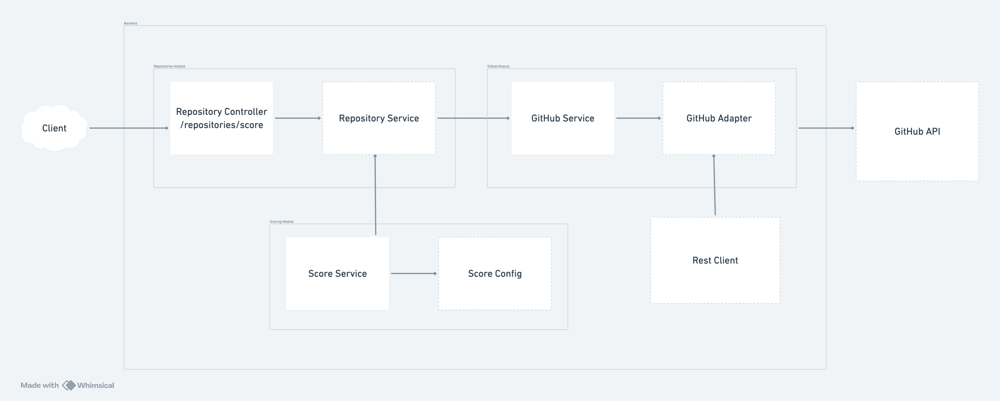

# repository-scoring-api

## Overview
This project is designed to score GitHub repositories based on stars, forks, recency of updates retrieved from the GitHub API. The architecture follows a layered approach to ensure separation of concerns, scalability, maintainability, performance, and testability.


## Technology Stack
- TypeScript – Static typing and modern JavaScript features.
- NestJS – Scalable, modular backend framework for Node.js.
- Axios – Promise-based HTTP client for API calls.
- Zod – Type-safe schema validation for inputs and queries (due to its huge popularity and ease of use).
- Jest – Testing framework for unit and integration tests.
- Swagger – Interactive API documentation.


## Installation & Setup
1. Clone the repository:

2. Install dependencies
   - `npm install`

3. Configure environment variables (.env.example file is provided for reference)
   - Create a `.env` file in the project root with:
     - PORT=3000
     - NODE_ENV=development
     - GITHUB_API_BASE_URL=https://api.github.com


## Run
- Dev mode (watch): `npm run start:dev`
- Prod build + run: `npm run build && npm run start`

## Run in Docker
- Dev mode (watch): `npm run docker:dev`
- Prod build + run: `npm run docker:prod`

The server listens on http://localhost:3000 & api is available to consume

Request example:
- GET /repositories/score
```bash
http://localhost:3000/repositories/score?language=typescript&created_at=2025-01-01
```

Response example:
```json
{
    "total_count": 1,
    "incomplete_results": false,
    "items": [
        {
            "id": 1,
            "full_name": "user/repo-name",
            "html_url": "https://github.com/user/repo-name",
            "description": "A brief description of the repository",
            "language": "TypeScript",
            "stargazers_count": 42,
            "forks_count": 7,
            "created_at": "2025-01-01T00:00:00Z",
            "updated_at": "2025-02-01T00:00:00Z",
            "score": 90
        }
    ]
}
```

For simplicity, a few example requests are included in the `API.http` file & could be run directly using the VS-Code REST Client extension.


## API Docs (Swagger)
- Swagger UI available at:
```bash
http://localhost:3000/api-docs
```

## Test
- Run Unit tests:
```bash
npm run test
```

- Run e2e tests:
```bash
npm run test:e2e
```

- Run test coverage:
```bash
npm run test:cov
```

# Architecture
### Overview
1.	Controller – Handles HTTP requests and query params.
2.	RepositoryService – Orchestrates the application logic.
3.	GithubService – Talks to GitHub’s API (builds queries, handles responses).
4.	GithubAdapter – Executes raw HTTP calls (focused only on data retrieval).
5.	ScoringService – Calculates repository popularity scores.


### Dependency Design

| Layer                 | Responsibility                                                             | Injects                          |
|:-------------------   |:---------------------------------------------------------------------------|:---------------------------------|
| **Controller**        | Parses HTTP requests and query parameters, delegates to the service layer. | `RepositoryService`              |
| **RepositoryService** | Core business logic — orchestrates fetching data and computing scores.     | `GithubService`, `ScoringService`|
| **GithubService**     | Integration layer — builds GitHub queries and handles external API logic.  | `GithubAdapter`                  |
| **GithubAdapter**     | Low-level HTTP adapter responsible for executing API calls.                | —                                |
| **ScoringService**    | Pure business logic — computes popularity scores (no I/O).                 | —                                |




## Architectural Decisions

- Layered architecture: Controller → RepositoriesService → GithubService → GithubAdapter; ScoringService remains pure and isolated.
- Adapter Pattern: `GithubAdapter` encapsulates GitHub-specific logic, while `RestClient` centralizes all Axios HTTP calls and consistent error handling. This abstraction ensures developers don’t need to worry about request details or error mapping — GET, POST, and other requests behave uniformly across the project.
- Scoring Configuration: `ScoringService` computes repository scores using metrics defined in a separate `METRICS` configuration. Any changes to the scoring algorithm (weights, formulas, or new metrics) only require updates to the config file, keeping the core service code untouched.
- URL Building (Builder Pattern): `UrlBuilder` utility composes GitHub queries (language, created) in a step-by-step manner. It’s easy to extend for pagination or additional filters.
- Schema-first validation & docs: Zod schemas with `nestjs-zod` generate Swagger documentation, while `ZodValidationPipe` enforces runtime validation. Internally, camelCase is used, but snake_case is applied for external API communication (both client-facing and GitHub API).

## Scoring Algorithm

The repository ranking algorithm evaluates popularity and relevance using multiple weighted metrics. It combines community approval, adoption, and recency into a single score.

Each repository receives a **popularity score** calculated from the following metrics:

| Metric       | Weight |
| ------------ | ------ |
| Stars        | 0.5    |
| Forks        | 0.3    |
| Recency      | 0.2    |

### How it Works

1. **Normalization:**  
   - Stars and forks are normalized relative to the maximum values in the dataset.  
   - Recency is measured using an exponential decay function — recent updates get higher scores.  
   - This ensures all metrics are on a comparable scale before combining.

2. **Weighted Combination:**  
   Each metric contributes according to its weight:  

Final score = 0.5 * stars_norm + 0.3 * forks_norm + 0.2 * recency_score

3. **Score Scaling:**  
- The raw weighted sum is passed through a sigmoid function to smooth differences and prevent extreme outliers from dominating the ranking.  
- Scores are then converted to a 0–100 scale for easy interpretation.

### Example

Suppose we have three repositories:

| Repo  | Stars | Forks | Days Since Update |
|-------|-------|-------|-----------------|
| A     | 100   | 50    | 30              |
| B     | 50    | 25    | 10              |
| C     | 150   | 75    | 90              |

**Step 1: Normalize stars and forks**

Max stars = 150, Max forks = 75

Stars normalized: A=0.67, B=0.33, C=1
Forks normalized:  A=0.67, B=0.33, C=1

**Step 2: Compute recency score** (using exponential decay, τ=180 days)

Recency score = exp(-days_since_update / τ)
A = exp(-30/180) ≈ 0.84
B = exp(-10/180) ≈ 0.95
C = exp(-90/180) ≈ 0.61

**Step 3: Weighted combination**

Repo A = 0.50.67 + 0.30.67 + 0.20.84 ≈ 0.71
Repo B = 0.50.33 + 0.30.33 + 0.20.95 ≈ 0.50
Repo C = 0.51 + 0.31 + 0.2*0.61 ≈ 0.92

**Step 4: Apply sigmoid & scale to 0 – 100**

Repo A ≈ 67
Repo B ≈ 50
Repo C ≈ 88

### Benefits

- **Balanced ranking:** Combines popularity, engagement, and activity into a single metric.  
- **Fair comparison:** Normalization ensures scores are relative to the dataset.  
- **Recency-sensitive:** Prioritizes actively maintained repositories over dormant ones.  
- **Extensible:** Additional metrics can be added with configurable weights.


## Performance & Realiability
- Rate Limiting: 10 requests per minute & 100 requests per hour per public IP (Mimics GitHub rate limits).
- Validate Data – Verify GitHub API responses match expected schemas & prevent invalid or malformed data from entering the system.


## Security
- Helmet.js - To prevent common web vulnerabilities by setting appropriate HTTP headers
- Rate Limiting -  To prevent API abuse (e.g., brute-force, DoS or DDoS attacks)
- Error Sanitization - Prevent leakage of sensitive information in error messages, stack traces or errors received from external services
- CORS - Cross-origin resource sharing
- Input Validation - Strict query parameter validation using Zod schemas


## Observability
- Logging Middleware: Logs incoming requests with method, URL, timestamp for trace
- Logger: Logging using NestJS Logger for consistent log formatting and levels


## Project Structure
```
src/
├── repositories/                       # Repository Module
│   ├── repositories.controller.ts      # Controller for repository endpoints
│   ├── repositories.service.ts         # Service for repository-related logic
│   └── repositories.module.ts          # Repository module definition
│
├── github/                             # GitHub Module
│   ├── github.controller.ts            # Controller for GitHub-related endpoints
│   ├── github.service.ts               # Service for GitHub-related logic
│   └── github.module.ts                # GitHub module definition
│
├── scoring/                            # Scoring Module
│   ├── scoring.service.ts              # Service for scoring logic
│   ├── scoring.config.ts               # Scoring static configuration
│   └── scoring.module.ts               # Scoring module definition
│
├── middleware/                         # Middlewares
│   └── logging.middleware.ts           # Logging middleware
│
├── guards/                             # Guards
│   └── rate-limit.guard.ts             # Rate limiting guard (Minute & hourly)
│
├── shared/                             # Shared resources
│   ├── dto/                            # Data Transfer Objects
│   │   
│   └── utils/                          # Shared utilities
│       ├── rest.client.ts              # REST client utility for external API calls
│       ├── url-builder.ts              # URL builder utility for constructing API URLs
│       ├── validation.pipe.ts          # Validation pipe for request query parameters
│       ├── constants.ts                # Constants used across the application
│       └── errors.ts                   # Custom error classes
```


## Potential Improvements
- Cache GitHub API responses: Add short-lived caching (e.g., Redis, 1–5 min TTL) or implement stale-while-revalidate to reduce latency and API calls.
- Add pagination support: Extend UrlBuilder to include page and per_page query params so users can control result count.
- Use `pushed_at` for code updates: Consider `pushed_at` instead of `updated_at` to score only actual code changes.
- CI/CD – Add GitHub Actions for lint, format, test, build
- Validate GitHub languages: Maintain a mapped list of supported languages and return a validation error if an invalid language is provided.
- Retries – Implement GitHub API requests with exponential backoff.
- Error Handling – Centralize error management across the project.
